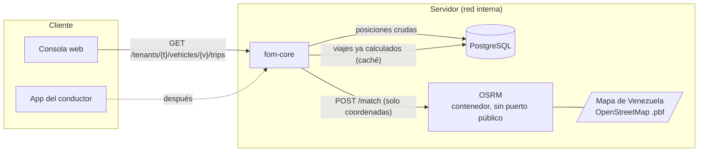

# OSRM propio: cómo sería y qué hay que hacer

Para: Juan · De: MP · 2 oct 2026 · Complementa #594 y la propuesta de mapa único (`docs/ISSUE-MAPA-UNICO.md`)

## 1. Qué es y para qué lo queremos

**OSRM** (Open Source Routing Machine) es un servicio gratuito que conoce la red de calles de OpenStreetMap.
Una de sus funciones, **map matching** (`/match`), recibe los puntos sueltos que mandó el GPS de un vehículo y devuelve el
camino real por las calles que probablemente recorrió, con su distancia.

Hoy la consola une los puntos del GPS con rectas. El resultado: líneas que cortan manzanas, se salen de la calle y,
cuando el GPS está parado, dibujan nubes de puntos. Con OSRM propio:

| Hoy | Con OSRM propio |
|---|---|
| Rectas entre puntos | Línea pegada a las calles |
| Distancia = suma de rectas (subestima las curvas, suma el ruido) | Distancia por la calle real |
| El cálculo de viajes y paradas vive en el navegador | Vive en el servidor, una vez, y lo comparten web y app |
| Cada pantalla repite el trabajo | Se calcula y se guarda |
| — | Base confiable para el **odómetro** |

**Por qué propio y no un servicio externo:** los recorridos de los vehículos son datos de clientes. Con un servicio de
terceros salen del servidor, dependemos de su disponibilidad y de sus límites y precios. Con OSRM propio no sale nada,
el costo por uso es cero y los límites son los nuestros.

## 2. Arquitectura



Reglas de la arquitectura:
- OSRM **solo habla con fom-core**, dentro de la red interna de Docker. Sin puerto publicado, sin acceso desde fuera.
- A OSRM solo viajan **coordenadas y horas**. Ninguna identidad (ni empresa, ni placa, ni conductor).
- Si OSRM no responde, fom-core **sigue funcionando**: devuelve los viajes con la línea recta y marca `matched: false`.

## 3. Qué hay que montar (Fase 1, en FOM-TEST)

### 3.1 Datos
1. Descargar el mapa de Venezuela de OpenStreetMap (Geofabrik publica extractos por país; archivo `.pbf`).
   Tamaño del orden de cientos de MB *(a confirmar al descargar)*.
2. Procesarlo una sola vez (en el servidor o en otra máquina) con las herramientas de OSRM:

```bash
osrm-extract   -p /opt/car.lua /data/venezuela-latest.osm.pbf
osrm-partition /data/venezuela-latest.osrm
osrm-customize /data/venezuela-latest.osrm
```

Perfil `car.lua` (el estándar); las camionetas y carros de la flota circulan por las mismas calles. Si hubiera camiones
pesados, se evalúa un perfil propio.

### 3.2 El contenedor
Imagen oficial `ghcr.io/project-osrm/osrm-backend`. Ejemplo para `docker-compose`:

```yaml
osrm:
  image: ghcr.io/project-osrm/osrm-backend:latest   # fijar una versión concreta
  command: osrm-routed --algorithm mld --max-matching-size 1000 /data/venezuela-latest.osrm
  volumes:
    - osrm-data:/data:ro
  networks: [fom-internal]        # la misma red que fom-core; NO se publica ningún puerto
  restart: unless-stopped
  mem_limit: 3g                   # a medir con el mapa real
  healthcheck:
    test: ["CMD-SHELL", "wget -qO- 'http://localhost:5000/route/v1/driving/-71.64,10.65;-71.52,10.53?overview=false' | grep -q '\"code\":\"Ok\"'"]
    interval: 30s
```

Notas:
- `--max-matching-size` sube el máximo de puntos por consulta (por defecto 100).
- Memoria, disco y tiempo de procesamiento: **medirlos en TEST**. Para un país del tamaño de Venezuela se espera algo
  manejable, pero no tengo la cifra exacta y no quiero inventarla.
- Siguiendo vuestra costumbre de operaciones (scripts fijados por hash, TEST antes que producción), todo esto va como
  scripts versionados.

### 3.3 Prueba a mano (antes de escribir código)
Con un recorrido real de un vehículo de prueba, desde dentro del servidor:

```bash
curl -s "http://osrm:5000/match/v1/driving/-71.640,10.650;-71.635,10.655;-71.630,10.660\
?timestamps=1790000000;1790000060;1790000120&radiuses=50;50;50\
&geometries=geojson&overview=full&gaps=ignore&tidy=true"
```

Respuesta (resumida): `matchings[].geometry` (la línea por las calles), `matchings[].distance` (metros),
`matchings[].confidence` (0–1) y `tracepoints[]` (el punto ajustado de cada entrada; `null` si no pudo ubicarlo).

**Punto delicado:** nuestros equipos reportan cada 1–5 minutos. Con puntos tan separados el ajuste es menos fiable
(entre dos puntos hay varias rutas posibles). Por eso `gaps=ignore` y la comparación de varios recorridos reales antes
de decidir. Si la calidad no alcanza, **Valhalla** (su módulo Meili) suele tolerar mejor puntos muy espaciados y se
puede probar en el mismo servidor con el mismo `.pbf`.

## 4. Lo que hace fom-core (Fase 2)

### 4.1 Módulo nuevo
- `RouteMatchingService`: llama a OSRM por HTTP con tiempo máximo (≈5 s), parte los recorridos en tramos de hasta 1000
  puntos y ensambla el resultado. Configuración: `FOM_OSRM_URL=http://osrm:5000`. Sin esa variable, no hay ajuste y todo
  sigue en línea recta.
- `TripsService`: con los puntos **crudos** del vehículo (la consulta de posiciones que ya existe):
  1. colapsa la deriva del GPS parado (los puntos quietos dentro de 100 m, a ≤ 8 km/h o con motor apagado, se vuelven uno);
  2. detecta paradas (≥ 5 min dentro de 100 m del centro del grupo);
  3. parte en viajes entre paradas y manda cada viaje a OSRM.
  El algoritmo ya existe y está probado en la web (`src/panel/datos/recorrido.js`, 17 pruebas). Se porta a TypeScript con
  las mismas pruebas, para que el servidor y el navegador no discrepen.

### 4.2 Ruta nueva
`GET /api/v1/console/tenants/{tenantId}/vehicles/{vehicleId}/trips?from&to`

- Rol: gestor (`requireManagerActor`); alcance: `requireVisible` (una compañía lee a sus contratistas).
- Respuesta:

```json
{
  "scope": { "tenantId": "…" },
  "range": { "from": "2026-10-01T04:00:00Z", "to": "2026-10-02T04:00:00Z" },
  "trips": [
    { "number": 1,
      "start": { "lat": 10.65, "lng": -71.64, "at": "…" },
      "end":   { "lat": 10.60, "lng": -71.55, "at": "…", "inProgress": false },
      "distanceM": 3412, "minutes": 12,
      "path": { "type": "LineString", "coordinates": [[-71.64,10.65], …] },
      "matched": true, "confidence": 0.93 }
  ],
  "stops": [ { "lat": 10.60, "lng": -71.55, "from": "…", "to": "…", "minutes": 21 } ],
  "truncated": false
}
```

### 4.3 Caché
- Tabla nueva `fom.vehicle_trips` (empresa, vehículo, inicio, fin, distancia, línea codificada, `matched`,
  huella de los puntos de origen, fecha de cálculo), con RLS por empresa como las demás.
- Solo se guardan los viajes **cerrados**; el que está en curso se calcula al pedirlo.
- Si cambian los puntos del rango (llegada tardía), la huella cambia y se recalcula.

### 4.4 Después: odómetro
La suma diaria de `distanceM` por vehículo, ya sin deriva y por la calle, es la base del odómetro calculado.
Se concilia contra el odómetro que reporta el equipo. Es otra fase.

## 5. Web y app (Fase 3)
- **Web:** deja de calcular y dibuja lo que llega. El cálculo local actual queda como respaldo si la ruta no responde.
- **App:** puede pedir lo mismo cuando haga falta (historial del conductor).

## 6. Operación

| Tema | Plan |
|---|---|
| Actualizar el mapa | Mensual: descargar el `.pbf` nuevo, reprocesar y cambiar el contenedor sin cortar el servicio (dos contenedores, se cambia el apuntador) |
| Si OSRM se cae | fom-core devuelve rectas con `matched: false`; la web avisa discretamente |
| Vigilancia | Salud del contenedor, tiempo de respuesta y proporción de viajes ajustados |
| Licencia | Datos de OpenStreetMap (ODbL): mostrar «© OpenStreetMap» donde se dibuje el mapa |
| Seguridad | Red interna, sin puerto público, solo coordenadas, sin llaves |
| Costo | Cero por uso. Cuesta el contenedor, el disco y la memoria |

## 7. Fases y reparto

| Fase | Qué | Quién | Salida |
|---|---|---|---|
| 0 | Confirmar espacio y memoria en TEST | Juan | Sí/no |
| 1 | OSRM en TEST + prueba a mano con 5 recorridos reales | Juan (montaje), MP (recorridos y revisión de calidad) | Decisión: OSRM o Valhalla |
| 2 | Módulo, ruta de viajes, caché y pruebas en fom-core | Juan, o MP en rama con su permiso | Ruta en TEST |
| 3 | La web consume la ruta | MP | Mapa con líneas por las calles |
| 4 | Producción | Juan | Despliegue |
| 5 | Actualización mensual del mapa | Juan | Script |
| 6 | Odómetro calculado | MP + Juan | Reporte de kilómetros |

## 8. Lo que necesito saber de ti
1. ¿Hay disco y memoria libres en TEST (y en producción) para un contenedor más?
2. ¿Prefieres OSRM o Valhalla para empezar? Propongo OSRM por sencillez y velocidad, y Valhalla como plan B si la
   calidad con puntos espaciados no alcanza.
3. ¿Quién escribe la Fase 2: tú, o la preparo yo en una rama como en #557?
4. La consulta de posiciones: ¿tiene índice por vehículo y hora para pedir 24 h sin lentitud? ¿Hay retención de datos?
5. ¿Dónde viven los scripts de operaciones donde debe entrar el montaje (estilo `ops/` fijado por hash)?

## 9. Riesgos
- **Puntos muy separados (1–5 min):** menor calidad de ajuste. Mitigación: medir con recorridos reales antes de
  comprometerse; Valhalla como alternativa; marcar `matched`/`confidence` y caer a rectas cuando sea baja.
- **Calles que faltan en OpenStreetMap** en la zona de operación: ninguna herramienta las inventa. Se completan en
  OpenStreetMap y se ven con la siguiente actualización mensual.
- **Consumo de memoria** al procesar el mapa: se hace una vez, fuera de horas de uso.
