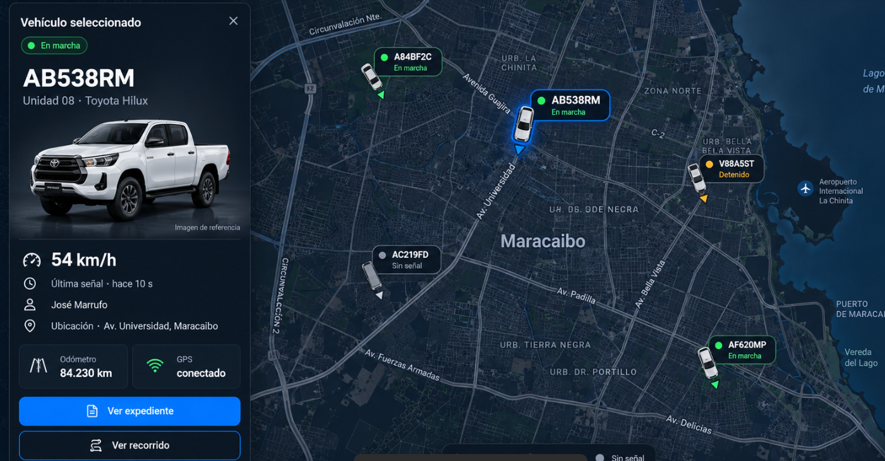

# FOM · Mapas y ficha de vehículo

Fecha: 29 de septiembre de 2026. Destinatario: Juan, implementación de la app.
Modo: **Operate**. Diseño aprobado por el usuario para todos los mapas de flota.
Este documento reemplaza el aspecto anterior de los marcadores circulares y la
ficha del vehículo. No sustituye el sistema del sitio publicitario ni cambia permisos.

## Referencia y archivos para compartir



La imagen es una referencia de composición. Sus carreteras, cifras, placas y
modelos no son datos operativos. La implementación usa el mapa real y los datos
de la empresa de la sesión.

| Archivo del repositorio | Función |
| --- | --- |
| `src/panel/comp/vehicleMarker.js` | SVG, dimensiones, ancla, escape de texto y rumbo del marcador. Compartir su geometría con la app. |
| `src/panel/datos/estadoUnidad.js` | Regla única de estados; copiar la misma lógica en móvil. |
| `src/panel/comp/FichaUnidad.jsx` | Orden y presentación de los campos y acciones. |
| `src/styles/fleet-map.css` | Estilos compartidos de marcadores, ficha y leyenda. |
| `src/styles/control-map.css` | Composición del centro de control y adaptación móvil. |
| `public/images/maps/vehicle-reference.png` | Camioneta blanca ilustrativa con transparencia. No es foto de una unidad. |
| `docs/mapas/marker-selected.svg` | Ejemplo del marcador seleccionado, para importar o comparar. |
| `docs/mapas/marker-stopped.svg` | Ejemplo de vehículo detenido. |
| `docs/mapas/marker-offline.svg` | Ejemplo sin señal. |

## Composición

El mapa ocupa el espacio de trabajo completo. Los elementos flotantes son:
barra superior con título, contador, búsqueda y acceso a unidades; filtros;
ficha izquierda del vehículo seleccionado; leyenda inferior y controles de zoom.
La interfaz no desplaza el mapa hacia una columna pequeña.

En otros módulos se reutilizan exactamente los marcadores y la ficha. El resumen
y el expediente conservan su disposición de mapa y ficha contigua. Los ejemplos
publicitarios conservan su identificación de demostración. Las capturas estáticas
anteriores no son mapas interactivos y no se modifican con estos componentes.

## Paleta literal

| Token | Valor | Uso |
| --- | --- | --- |
| map.surface | `#0B1927` | Fondo de ficha, placas y controles |
| map.surface-raised | `#10202F` | Casillas de odómetro y conexión |
| map.border | `#263B4D` | Bordes discretos |
| map.text | `#F3F7FC` | Texto principal |
| map.text-secondary | `#B7C7D9` | Datos secundarios |
| map.selection | `#168FFF` | Contorno de selección y dirección seleccionada |
| map.action | `#0075E6` | Botón principal con texto blanco |
| map.moving | `#35E888` | En marcha, reportando o encendido |
| map.stopped | `#FFBF43` | Detenido o apagado |
| map.offline | `#A1AFBF` | Sin señal |
| map.focus | `#85C9FF` | Foco visible |

La selección azul no reemplaza el color de estado: el seleccionado mantiene
su punto y texto verde, ámbar o gris. Siempre acompañar el color con palabras.
En la web Leaflet usa teselas OSM y un filtro oscuro; no copiar la geografía
de la propuesta generada. Mantener siempre la atribución del proveedor visible.

## Tipografía, espaciado y bordes

Usar Spline Sans donde esté disponible; en móvil respetar el escalado accesible.
Placa: 32 px / 1.1 / peso 700, tracking -0.025em; 24–28 px en móvil.
Título de ficha: 17 px / 1.3 / peso 600. Velocidad: 24 px, unidad 18 px.
Datos: 13–14 px. Etiquetas: 12 px. Estado: 12 px / peso 500.
Caption ilustrativo: 10 px, nunca esconder que la foto es de referencia.
Para teléfono usar equivalentes en dp/sp y permitir crecimiento de texto;
las medidas web pequeñas no son una excusa para bloquear accesibilidad nativa.

Ficha: padding 18 px, radio 14 px. Separación interna: 8, 10, 12 y 16 px.
Casillas: radio 10 px. Botones: radio 10 px y altura mínima 44 px.
Foco: trazo de 3 px con separación de 3 px. No usar brillos neón.

## Marcador de vehículo

Un marcador combina un vehículo visto desde arriba, una placa y un estado.
No volver a sustituirlo por un círculo. La placa es el identificador principal;
si falta, usar alias o «Sin placa».

Geometría de la web:

- Lienzo SVG: **174 × 76 px**.
- Ancla geográfica: **(26, 40)**, centro del vehículo, no centro de la etiqueta.
- Cuerpo del vehículo: 22 × 44 px, con neumáticos y ventanas distinguibles.
- Etiqueta: x=46, y=3, ancho=125, alto=46, radio=12.
- Placa: 13 px / peso 700; estado: 11 px. Placas largas se reducen a 10 px.
- Selección: borde azul 2.5 px y contorno azul del vehículo. Resto: borde 1 px.
- Rumbo: norte=0°, este=90°, sur=180°, oeste=270°. Rotar SOLO el vehículo y
  su flecha. La etiqueta siempre queda horizontal.
- Sin rumbo válido: icono vertical neutro SIN flecha. No simular un rumbo.

En React Native Maps, un lienzo idéntico usaría
`anchor={{x: 26 / 174, y: 40 / 76}}`. Si el mapa rota, convertir el rumbo mundial
a orientación de pantalla restando el bearing de la cámara; no rotar dos veces.
No usar `flat/rotation` para girar toda la etiqueta.

En Leaflet las etiquetas que colisionan se ocultan, conservando los vehículos.
La seleccionada siempre gana; foco o hover revela las demás. La lista «Unidades»
permite elegir vehículos superpuestos o sin coordenadas. En móvil ofrecer esa
misma lista, y a escala de flota extensa añadir clustering sin alterar posiciones.
Google usa el mismo SVG; la supresión de etiquetas por colisión se implementó
en Leaflet, no en el proveedor opcional de Google.

## Estado: no inventar movimiento

Aplicar esta prioridad, igual a `estadoUnidad.js`:

1. `conectado === false`: **Sin señal**, aunque quede velocidad antigua.
2. `estadoMarcha === 'en_marcha'` o velocidad finita > 0: **En marcha**.
3. `estadoMarcha === 'parada'` o velocidad exactamente 0: **Detenido**.
4. Sin velocidad ni estado de movimiento, contacto `true`: **Encendido**.
5. Contacto `false`: **Apagado**.
6. Conexión confirmada sin esos datos: **Reportando**.
7. Sin datos suficientes: **Sin señal**.

«Reportando» NO significa «En marcha». La antigüedad que invalida una señal debe
venir del contrato de telemetría; no inventar un umbral diferente en cada cliente.
El adaptador web actual deriva parte de la conexión del último reporte: revisar
ese contrato al incorporar nuevos campos de frescura del backend.

## Ficha del vehículo

Orden de lectura:

1. «Vehículo seleccionado» y cerrar, con objetivo táctil 44 × 44.
2. Estado; placa grande; alias y marca/modelo/año que existan.
3. Imagen ilustrativa completa sin recortar ruedas; caption «Imagen de referencia».
4. Velocidad real; si falta, «Sin velocidad GPS», nunca `0 km/h` inventado.
5. Última señal, conductor y ubicación. Sin dirección usar coordenadas reales;
   no geocodificar ni inventar una avenida desde la imagen de referencia.
6. Dos casillas: odómetro y estado de conexión GPS. Si falta un dato, «Sin dato».
7. «Más información»: combustible, aceite, motor, área, temperatura, índice,
   IMEI y coordenadas SOLO cuando esos campos existan. No perder telemetría
   anterior por el rediseño.
8. «Ver expediente», botón principal; «Ver recorrido», secundario cuando exista
   la acción en ese contexto. No presentar botones decorativos sin funcionalidad.

En el centro de control «Ver recorrido» muestra/oculta el trazado real del día.
Si está vacío, informar «No hay posiciones registradas para el recorrido de hoy».
Si falla la consulta, permitir reintentar. La ficha permanece usable mientras carga.
El recorrido se consulta por vehículo y se actualiza cada 15 s junto al detalle.

La imagen blanca es un recurso genérico, no afirmar que una Jeep o un sedán sea
esa pickup. En cuanto exista una foto de la unidad verificada por la API, usarla;
hasta entonces conservar el caption. No derivar marca, modelo o color de la foto.

## Escritorio y móvil

Web de escritorio: ficha de 352 px, margen izquierdo 20 px, bajo filtros a 160 px.
La barra superior tiene margen izquierdo para el menú de navegación. La ficha
ocupa como máximo la altura disponible y desplaza internamente los datos; sus
acciones permanecen visibles. El mapa reserva aproximadamente 175 px de centro
hacia la derecha para que el vehículo seleccionado no quede oculto.

Web ≤600 px: ficha inferior con márgenes 12 px y altura 44dvh; datos desplazables,
imagen compacta de 100 px y acciones visibles. Zoom a la derecha y atribución
siempre descubierta. Reservar la zona superior útil al centrar el vehículo.

Para app nativa: implementar la misma ficha como bottom sheet, con safe areas,
posición compacta y expandida. Mantener placa/estado al frente y datos en scroll;
no copiar los controles del navegador ni la barra lateral de escritorio.
TalkBack/VoiceOver: nombre accesible «[placa], [estado]» y estado seleccionado.
Permitir cerrar sin perder la posición del mapa. Recorrido y expediente deben
usar las rutas reales de navegación de la app.

## Datos mínimos

```ts
type VehicleMapView = {
  id: string;
  placa?: string;
  alias?: string;
  marca?: string;
  modelo?: string;
  anio?: number | null;
  lat: number | null;
  lng: number | null;
  rumbo?: number | null;          // grados desde norte
  velocidadKmh?: number | null;
  estadoMarcha?: 'en_marcha' | 'parada' | null;
  ignition?: boolean | null;
  conectado?: boolean;
  ultimoReporte?: string | null;
  km?: number | null;
  conductorNombre?: string | null;
  ubicacionTexto?: string | null;
  recorrido?: {lat: number; lng: number}[];
};
```

Coordenadas: finitas, latitud -90…90, longitud -180…180; cero es válido.
Vehículos sin posición permanecen en la lista, no colocarlos en `(0,0)`.
Escapar placa/alias si se generan SVG o HTML. Mantener aislamiento por empresa
en el servidor. El cambio visual no autoriza a mostrar flotas ajenas.

## Movimiento y rendimiento

Interpolar posiciones cercanas durante 1200 ms con ease-out cúbico; cancelar
interpolación anterior si llega otra posición. Saltos >0.05° se colocan directamente
para no dibujar un viaje ficticio. Con movimiento reducido, actualización directa.
No hay pulso infinito ni rotación ornamental. No recargar teselas en cada reporte.
En la app, evitar actualizar vistas de marcadores cuando los datos no cambiaron.

## Validación de entrega

- Estado sin señal con velocidad antigua: no aparece verde «En marcha».
- Velocidad `null`, rumbo `null` y posición `null` no se convierten en ceros.
- Selección, cerrar, lista, búsqueda y recorrido funcionales.
- Teclado en web; lector y objetivos táctiles de 44 px en app.
- Verificar flota densa, placa larga, giro de mapa y pantalla pequeña.
- Proveedor real y atribución conservados. No sustituir el mapa por esta imagen.

La web local fue compilada y sus reglas de estado/marcador tienen pruebas.
El proveedor Google queda adaptado en código, pero requiere su clave para
verificación visual; no confundir compilación con una prueba real de ese servicio.

## Origen del recurso visual

Pickup generada con la herramienta integrada de imágenes, fondo transparente.
Prompt: «White double-cab pickup, front three-quarter view nose facing left,
entire vehicle visible, no readable badges or text, blank plate, soft studio
lighting, transparent background; generic reference illustration, not a real
vehicle photograph». No se usaron datos privados del vehículo en la generación.
