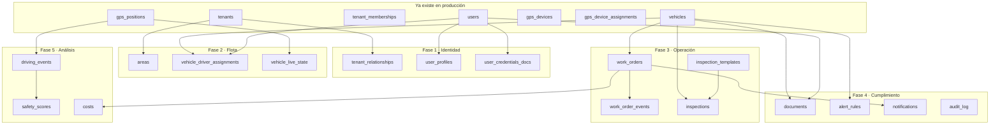

# Mapa: llevar el dominio FOM-02 a la base de datos real

Cómo yo construiría lo que falta, sobre lo que `fom-core` ya tiene.

Escrito el 12 de agosto de 2026, después de revisar `juancpachecog/fom-core`
en `main` (commit `0df6471`). Es una propuesta para discutir, no una decisión
tomada: el proyecto decide por Issue y PR.

---

## El principio: extender, nunca duplicar

La tentación es portar el esquema de Supabase tal cual y crear `empresas`,
`perfiles`, `gps`, `vehiculos`. Sería un error: `fom-core` **ya tiene esas
entidades**, con nombres en inglés, multi-tenant y con restricciones más
estrictas que las de la BD provisional. Duplicarlas produce dos verdades sobre
la misma cosa y ninguna gana.

El mapeo real es este:

| FOM-02 (BD provisional) | Producción | Qué falta |
|---|---|---|
| `empresas` | `fom.tenants` | Distinguir contratista / compañía, y los datos de contacto |
| `empresa_predefinidas` | — | Tabla de relación entre tenants |
| `perfiles` (identidad + rol) | `fom.users` + `fom.tenant_memberships` | Los datos personales y la licencia |
| `perfiles.rol` | `tenant_memberships.role` | Fijar el catálogo de roles |
| `vehiculos` | `fom.vehicles` | Alias, tipo, área, conductor asignado |
| `vehiculos` (telemetría) | `fom.gps_positions` | **Velocidad, encendido, odómetro** |
| `gps` | `fom.gps_devices` | Nada: está más completo |
| `vehiculos.gps_id` | `fom.gps_device_assignments` | Nada: además guarda historial |
| `areas`, `odts`, `inspecciones`, `documentos`, `reglas_alerta`, `notificaciones`, `auditoria`, `pagos` | — | Todo |

Dos cosas que producción hace **mejor** y hay que conservar:

- **Un usuario puede pertenecer a varios entes.** `tenant_memberships` es una
  tabla, no una columna `empresa_id`. La BD provisional obligaba a mover a una
  persona de empresa; aquí puede tener membresías simultáneas con roles
  distintos. No lo rompas volviendo a la columna única.
- **La instalación del GPS tiene historial.** `gps_device_assignments` guarda
  `installed_at` y `removed_at`. Saber qué equipo traía una unidad en marzo es
  una pregunta real de auditoría que el `gps_id` de la BD provisional no
  respondía.

---

## Las tres decisiones previas — resueltas

Ninguna migración debía escribirse antes de resolver esto. Las tres quedaron
decididas el 12 de agosto de 2026; se conserva el razonamiento para que dentro
de seis meses se sepa **por qué** y no haya que rediscutirlo.

**1 · ¿Cómo se modela contratista contra compañía?** — ✅ **DECIDIDO: columna explícita**
`tenants.kind` solo distingue `individual` de `organization`, así que no separa
a Chevron de Samfor: las dos son `organization`. Se agrega
`tenants.category` (`compania` | `contratista` | `personal`) y una tabla
`tenant_relationships` N:M para «quién trabaja para quién».

Las dos piezas son **independientes**, y eso es lo que hace que el modelo
aguante todos los casos reales:

| Ente | `category` | Relaciones |
|---|---|---|
| Contratista sola, sin compañía encima | `contratista` | ninguna |
| Samfor, trabaja para Chevron | `contratista` | 1 |
| Samfor, trabaja para Chevron y PDVSA | `contratista` | 2 |
| Compañía recién creada, aún sin contratistas | `compania` | ninguna |

Se descartó inferir la categoría a partir de las relaciones. Con esa vía, la
**contratista sola** y la **compañía todavía sin contratistas** tienen ambas
cero relaciones: son indistinguibles, y el sistema tiene que adivinar. Además
las reglas del producto consultan el tipo directamente — «una compañía no opera
flota propia» y «los perfiles personales solo existen en cuentas personales»
están escritas así en `catalogos.js` del sitio web.

**2 · ¿La consola de flota sale a Internet?** — ✅ **DECIDIDO: sí**
El cliente entra por la página web o por la app móvil. Ninguno de los dos va a
montar WireGuard. Eso convierte la fase 6 en requisito, no en opcional, y
adelanta su planificación: publicar exige proxy inverso, certificado y una IP
pública adicional en OVH, y esos plazos no dependen del código.

Consecuencia de diseño: la API queda partida en dos superficies.
`gps-console-internal/api` sigue siendo interna y solo alcanzable por el puente
privado; la nueva `/api/v1/*` es la única que se publica, con CORS restringido
al dominio de la consola y límite de peticiones. La app móvil consume esa misma
`/api/v1/*`, así que el contrato tiene que servir a web y a móvil desde el
primer día.

**3 · ¿Una consola o dos?** — ✅ **DECIDIDO: separadas**
`apps/gps-web` es la consola de **operación de la plataforma**: equipos, SIMs,
datos crudos, puesta en marcha. La consola de **flota** es otro producto para
otro usuario: el supervisor que ve unidades, ODTs y documentos. Van separadas
sobre el mismo backend; mezclarlas obligaría a esconder media interfaz según el
rol y terminaría sirviendo mal a los dos.

---

## El mapa

---

### Fase 1 · Identidad y organización

**Migración (expand):**

- `tenants` += `category` (`contratista` | `compania` | `personal`), `rif`,
  `phone`, `email`, `contact_name`, `brand_color`
- `fom.tenant_relationships` — `company_tenant_id`, `contractor_tenant_id`,
  vigencia. Sustituye a `empresa_predefinidas`
- `fom.user_profiles` — `user_id` 1:1, `national_id`, `phone`, `address`,
  `birth_date`, `photo_url`, `profile_completed_at`
- `fom.user_credentials` — licencia y certificado médico: `kind`, `number`,
  `category`, `expires_at`. Una tabla, no dos: ambos son documentos con
  vencimiento que bloquean a un conductor
- Catálogo de roles en `tenant_memberships.role` con un `CHECK`:
  `admin_fom`, `supervisor`, `conductor`, `usuario`

**Módulos Nest:** `organizations`, `people`

**Qué habilita:** dar de alta entes y personas de verdad, con sus permisos. Sin
esto no hay nada más, porque todo cuelga del tenant.

> **El servicio suspendido ya existe:** `tenants.status = 'suspended'`. No
> inventes `servicio_activo`.

---

### Fase 2 · Flota, y el hueco de la telemetría

**Migración (expand):**

- `vehicles` += `alias`, `vehicle_type` (`camioneta`|`camion`|`auto`|`otro`),
  `area_id`, `fleet_number`
- `fom.areas` — `tenant_id`, `name`, `kind` (`ubicacion`|`sector`|`contrato`)
- `fom.vehicle_driver_assignments` — vehículo, usuario, `role`
  (`principal`|`secundario`), `pin_hash`, `from`/`to`. Con historial, igual que
  las asignaciones de GPS. Nunca una columna `conductor_principal_id`
- **`gps_positions` += `speed_kph`, `heading_deg`, `ignition`, `odometer_km`**
- `fom.vehicle_live_state` — última posición conocida por vehículo, escrita por
  el pipeline canónico

**Módulo Nest:** `fleet`. **Worker:** actualizar `vehicle_live_state` al
persistir cada posición.

> ### El hallazgo que hay que atender primero
>
> **Hoy no se guarda la velocidad.** Revisé las migraciones y el decodificador
> canónico: `gps_positions` solo persiste latitud, longitud y validez. No hay
> velocidad, rumbo, encendido ni odómetro, y el decodificador tampoco los
> extrae.
>
> Sin ese dato **no existen**: el estado "en marcha / parada", el velocímetro de
> la consola, el índice de manejo seguro, las reglas de alerta por exceso de
> velocidad, el kilometraje y las reglas de mantenimiento por km. Es decir, la
> mitad visible del producto.
>
> El protocolo Coban sí transmite velocidad. Es trabajo de decodificador, no de
> hardware. **Yo lo pondría como el primer Issue de todo el plan**: es barato y
> desbloquea cinco funciones de una vez.
>
> **Corrección (13 ago 2026).** Una versión anterior de este documento decía que
> las posiciones ya guardadas «no se pueden recuperar». Es falso, y conviene
> saberlo antes de tomar decisiones apuradas: `gps_raw_messages.payload` conserva
> los **bytes exactos** de cada trama recibida, la tabla es append-only y no hay
> ninguna purga configurada. La clave de idempotencia de `gps_positions` incluye
> `decoder_version`, así que un decodificador nuevo puede reprocesar el histórico
> e **insertar** posiciones completas sin chocar con las viejas.
>
> Lo que sí corre es otro reloj: el día que se introduzca una política de
> retención sobre las tramas crudas, la pérdida pasa a ser definitiva. La
> urgencia es real, pero es de oportunidad, no de datos que se estén evaporando.

> **El estado vivo se deriva, no se escribe a mano.** `vehicle_live_state` es
> una proyección del pipeline. En cuanto alguien pueda hacer `UPDATE` de la
> velocidad de un vehículo desde un endpoint, la consola empieza a mentir.

---

### Fase 3 · Operación

**Migración:**

- `fom.work_orders` — ODT: tenant, vehículo, autor, `kind`
  (`correctiva`|`preventiva`), `status`, descripción, tipo de falla, evidencias,
  cierre (nota, costo, `resolved_at`), regla de origen
- `fom.work_order_events` — cada cambio de estado con quién y cuándo. La BD
  provisional resolvía el cierre con un trigger sobre una columna; un histórico
  responde además "cuánto estuvo en revisión", que es la métrica que el
  supervisor pide
- `fom.inspection_templates` + `fom.inspection_template_items` — el checklist
  deja de estar en el código
- `fom.inspections` + `fom.inspection_answers`

**Módulos Nest:** `maintenance`, `inspections`. Al crear una ODT se publica un
evento en RabbitMQ; las notificaciones las produce un consumidor, no un trigger.

> **Por qué eventos y no triggers de Postgres.** La BD provisional creaba la
> notificación dentro de un trigger. Funciona, pero esconde efectos en la base,
> no se puede probar sin base y no reintenta. RabbitMQ ya está desplegado y es
> justo para esto.

---

### Fase 4 · Cumplimiento, alertas y auditoría

**Migración:**

- `fom.documents` — ámbito vehículo o persona, tipo, `expires_at`, archivos
- `fom.alert_rules` + `fom.alert_rule_vehicles` — umbral de velocidad o
  kilómetros entre servicios, con contador por vehículo
- `fom.notifications` — bandeja del panel
- `fom.audit_log` — actor, acción, objetivo, tenant, fecha

**Worker:** un consumidor evalúa cada posición contra las reglas de velocidad,
acumula kilómetros para las de mantenimiento y genera ODT preventiva al llegar
al umbral. Un trabajo diario revisa vencimientos de documentos y licencias.

**Módulos Nest:** `compliance`, `notifications`, `audit`

---

### Fase 5 · Índice de manejo seguro y costos

**Migración:**

- `fom.driving_events` — exceso de velocidad, frenada brusca, aceleración
  brusca, derivados de la serie de posiciones
- `fom.safety_scores` — agregado por vehículo, conductor y período.
  Candidato natural a *continuous aggregate* de TimescaleDB
- `fom.costs` — combustible, repuestos, neumáticos, mano de obra, con enlace
  opcional a la ODT que los originó

**Módulo Nest:** `analytics`

Va al final por dos razones: depende de la velocidad de la fase 2, y es lo
único que la operación puede seguir haciendo en papel mientras tanto.

---

### Fase 6 · Publicación y consola

- Proxy inverso con TLS en `fom-fw-edge-01`
- API pública versionada `/api/v1/*`, **separada** de
  `gps-console-internal/api`, que sigue siendo interna
- Límite de peticiones, CORS restringido al dominio de la consola
- La consola de flota consume esa API con la sesión de cookie que
  `authentication` ya emite

---

## Reglas transversales

**Multi-tenant sin excepciones.** Toda tabla nueva lleva `tenant_id` y la clave
foránea compuesta `(tenant_id, id)` que el repositorio ya usa en `vehicles` y
`gps_devices`. Ese patrón hace **imposible** a nivel de base que una fila
referencie algo de otro tenant. Cópialo, no lo reinventes.

**Expand / contract, siempre.** Agregar columna con valor por defecto, escribir
en las dos formas, migrar los datos, y solo después retirar la vieja. Las
migraciones no corren solas: son una fase operacional con autorización aparte.

**Nombres en inglés.** El repositorio es consistente en eso. La interfaz de la
consola sigue en español; la traducción vive en la capa de presentación, como ya
lo hace `catalogos.js` en el sitio web.

**Nada de datos derivados escritos a mano.** Estado de marcha, índices y
contadores son proyecciones de la telemetría. Si un endpoint puede
sobrescribirlos, la consola miente sin que nadie se entere.

---

## Cómo se ejecuta

El repositorio tiene un proceso escrito y hay que respetarlo: un Issue con la
plantilla `codex-task.md`, rama, PR en borrador temprano, CI en verde, squash.
Nada de push directo a `main`. Migración, seed y despliegue son fases separadas
que el merge **no** autoriza.

Un Issue por bloque de tablas relacionadas, no uno por tabla suelta ni uno por
fase entera.

**El orden que yo seguiría:**

1. **Velocidad en el decodificador y en `gps_positions`** — barato, desbloquea
   cinco funciones y detiene la pérdida diaria de datos
2. Fase 1 completa — sin identidad no hay nada
3. Fase 2 — con esto la consola ya muestra flota real sobre el mapa real
4. Decidir la publicación (fase 6) **en paralelo**, porque tiene plazos de
   infraestructura y certificados que no dependen del código
5. Fase 3, que es el corazón operativo del producto
6. Fases 4 y 5

Cada fase deja algo utilizable. Si el proyecto se detiene después de la 2, hay
un producto que muestra la flota en vivo; si se detiene después de la 3, hay uno
que además gestiona mantenimiento.
